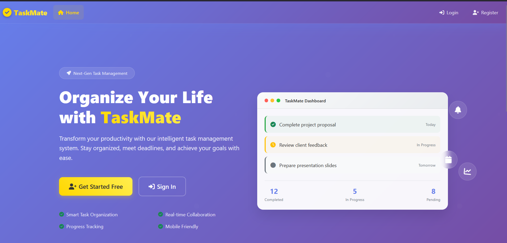
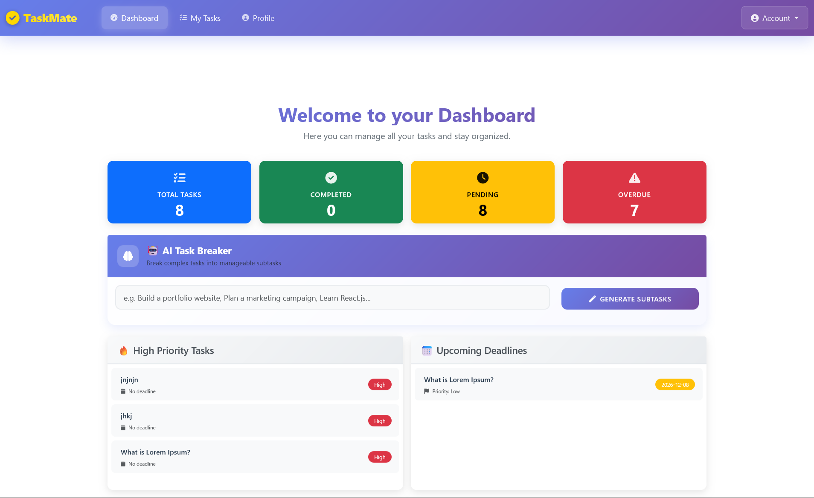
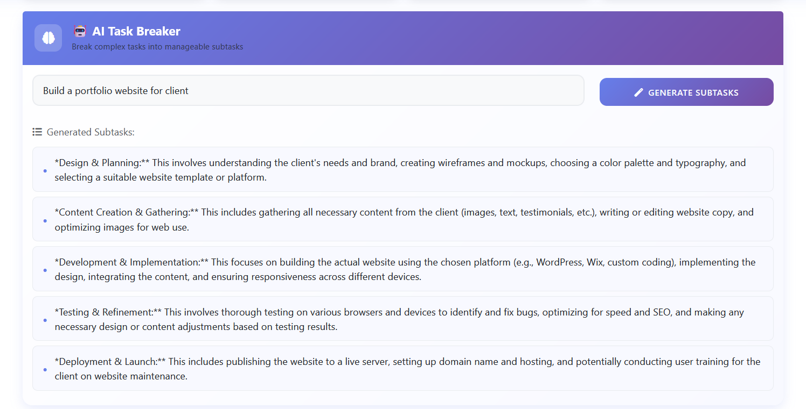
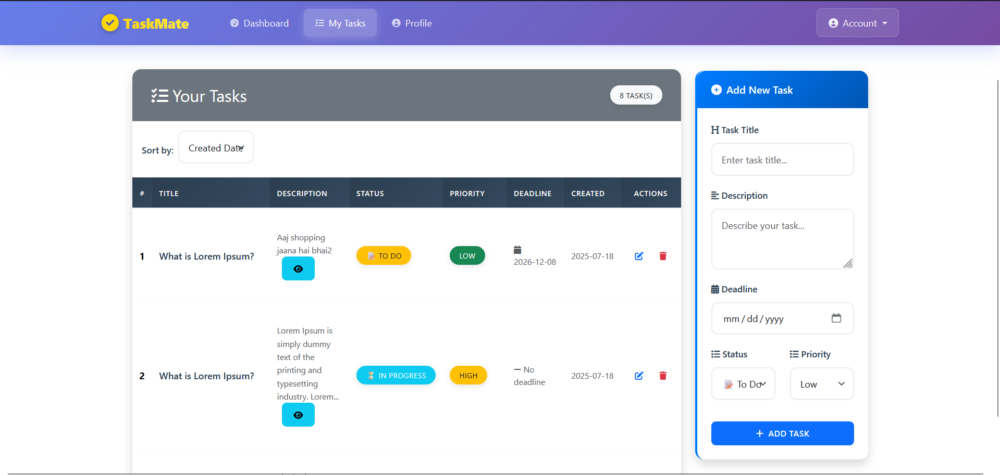

# TaskMate AI - Intelligent Task Management Platform

A sophisticated, modern task management web application built with Flask, featuring comprehensive user authentication, advanced task management capabilities, **AI-powered task breakdown**, and a stunning responsive UI with glassmorphism design.

## ✨ Key Features

### 🤖 **AI-Powered Task Management**
- **Intelligent Task Breakdown**: AI-powered subtask generation using Google Gemini
- **Smart Task Analysis**: Break complex tasks into manageable 3-5 subtasks
- **Natural Language Processing**: Enter tasks in plain English for AI processing
- **Rate-Limited API**: Optimized API calls with built-in rate limiting
- **Fallback Handling**: Graceful error handling with user-friendly messages

### 🔐 **Advanced Authentication System**
- Secure user registration and login with password hashing
- Session-based authentication with automatic redirects
- Protected routes and user-specific data isolation
- Password confirmation validation

### 📋 **Comprehensive Task Management**
- **Create & Edit Tasks**: Full CRUD operations with intuitive forms
- **Status Tracking**: "To Do", "In Progress", and "Done" with visual indicators
- **Priority Levels**: High, Medium, Low priority classification
- **Deadline Management**: Set and track task deadlines
- **Smart Sorting**: Sort tasks by creation date, deadline, or priority
- **Task Statistics**: Real-time dashboard with completion metrics

### 🎨 **Modern User Interface**
- **Glassmorphism Design**: Beautiful transparent and frosted glass effects
- **Gradient Backgrounds**: Modern purple-to-blue gradients throughout
- **Responsive Layout**: Perfect experience on desktop, tablet, and mobile
- **Interactive Elements**: Smooth animations and hover effects
- **Consistent Navigation**: Unified navbar across all pages
- **Professional Landing Page**: Compelling hero section with feature highlights

### 📊 **Dashboard & Analytics**
- **Task Overview**: Visual cards showing total, completed, in-progress tasks
- **Overdue Tracking**: Automatic identification of overdue tasks
- **High Priority Display**: Quick access to important tasks
- **Upcoming Deadlines**: Timeline view of approaching due dates
- **Progress Visualization**: Clear metrics and statistics
- **AI Task Breaker**: Prominently positioned AI-powered task breakdown interface

### 🔧 **Technical Excellence**
- **Database Integration**: SQLite with CS50 SQL library
- **Environment Configuration**: Secure environment variable management
- **Error Handling**: Professional apology pages with helpful messages
- **Form Validation**: Comprehensive client and server-side validation
- **Security**: CSRF protection and input sanitization

## 🛠️ Technology Stack

### **Backend Technologies**
- **Python Flask 3.1.1**: Robust web framework with modern features
- **Google Generative AI (Gemini)**: Advanced AI for task breakdown and analysis
- **SQLite3**: Lightweight, serverless database
- **CS50 SQL Library**: Simplified database operations
- **Werkzeug**: Advanced password hashing and security
- **Python-dotenv**: Environment variable management

### **Frontend Technologies**
- **HTML5 & CSS3**: Modern web standards with semantic markup
- **Bootstrap 5.3.3**: Responsive framework with advanced components
- **Font Awesome 6.0**: Comprehensive icon library
- **Custom CSS**: Advanced glassmorphism and gradient effects
- **JavaScript**: Interactive AI features and smooth animations

### **Development & Deployment**
- **Virtual Environment**: Isolated Python environment
- **Git Version Control**: Professional code management
- **Environment Variables**: Secure configuration management

## 🤖 AI Features & Setup

### **Google AI API Configuration**
1. **Get API Key**: Visit [Google AI Studio](https://aistudio.google.com/) and create an API key
2. **Add to Environment**: Add `GOOGLE_AI_API_KEY=your-key-here` to your `.env` file
3. **Rate Limits**: Free tier allows 15 requests per minute
4. **Built-in Throttling**: App automatically manages rate limiting (4-second delays)

### **AI Task Breakdown Features**
- **Intelligent Analysis**: Converts complex tasks into 3-5 manageable subtasks
- **Natural Language**: Enter tasks in plain English
- **Smart Formatting**: Automatically cleans and formats AI responses
- **Error Handling**: Graceful fallbacks for API limitations
- **Visual Feedback**: Loading states and clear error messages

### **Usage Examples**
```
Input: "Build a portfolio website"
AI Output:
• Research design trends and gather inspiration
• Plan website structure and create wireframes  
• Set up development environment and tools
• Code responsive layout and implement features
• Test functionality and deploy to hosting platform
```

## 📋 Prerequisites

- Python 3.8 or higher
- pip (Python package installer)

## 🔧 Installation

1. **Clone the repository**
   ```bash
   git clone https://github.com/Utpal-Kalita/taskmate-ai.git
   cd taskmate-ai
   ```

2. **Create a virtual environment**
   ```bash
   python -m venv env
   ```

3. **Activate the virtual environment**
   - On Windows:
     ```bash
     env\Scripts\activate
     ```
   - On macOS/Linux:
     ```bash
     source env/bin/activate
     ```

4. **Install dependencies**
   ```bash
   pip install -r requirements.txt
   ```
   
   **Dependencies include:**
   - `Flask==3.1.1` - Web framework
   - `python-dotenv==1.1.1` - Environment variables
   - `google-generativeai==0.8.5` - AI integration
   - `requests==2.32.4` - HTTP client
   - `cs50` - Database library

5. **Set up environment variables**
   Create a `.env` file in the project root:
   ```
   FLASK_APP=app.py
   FLASK_DEBUG=True
   SECRET_KEY=your-secret-key-here
   GOOGLE_AI_API_KEY=your-google-ai-api-key-here
   ```
   
   **Get your Google AI API Key:**
   1. Visit [Google AI Studio](https://aistudio.google.com/)
   2. Create a new API key
   3. Copy and paste it into your `.env` file

6. **Run the application**
   ```bash
   python app.py
   ```

7. **Open your browser**
   Navigate to `http://127.0.0.1:5000`

## 📁 Project Architecture

```
taskmate-ai/
├── 📱 app.py                    # Main Flask application with AI integration
├── 📦 requirements.txt          # Python dependencies
├── 🔐 .env                     # Environment variables (create this)
├── 📝 .gitignore              # Git ignore configuration
├── 🗄️ taskmate.db             # SQLite database (auto-created)
├── 📄 README.md               # Project documentation
├── 📁 templates/              # Jinja2 HTML templates
│   ├── 🏗️ layout.html         # Base template with navbar
│   ├── 🏠 index.html          # Modern landing page with hero section
│   ├── 🔑 login.html          # User login interface
│   ├── ✍️ register.html       # User registration with validation
│   ├── 📊 dashboard.html      # Analytics dashboard with AI Task Breaker
│   ├── ✅ my_task.html        # Task management with CRUD operations
│   ├── ✏️ edit_task.html      # Task editing interface
│   ├── 👤 profile.html        # User profile management
│   └── ❌ apology.html        # Error handling page
├── 📁 static/                 # Static assets
│   └── 🤖 script.js           # AI task breaker JavaScript
├── 📁 utils/                  # Utility modules
│   └── 🗄️ database.py        # Database initialization and schema
└── 📁 env/                    # Virtual environment (local)
```

## 🎯 User Guide

### **Getting Started**
1. **Visit the Landing Page**: Beautiful hero section with TaskMate overview
2. **Create Account**: Click "Register" and fill in your credentials
3. **Secure Login**: Access your personal dashboard with task statistics

### **Dashboard Overview**
- **Task Statistics**: Visual cards showing total, completed, in-progress, and overdue tasks
- **High Priority Tasks**: Quick access to your most important tasks
- **Upcoming Deadlines**: Timeline of tasks approaching their due dates
- **Progress Tracking**: Real-time completion metrics
- **AI Task Breaker**: Intelligent task breakdown interface prominently positioned for easy access

### **AI Task Breakdown Workflow**
1. **Access AI Features**: Find the AI Task Breaker prominently displayed on your dashboard
2. **Input Your Task**: Enter any complex task in plain English (e.g., "Build a portfolio website")
3. **Generate Subtasks**: Click "Generate Subtasks" to get AI-powered breakdown
4. **Review Results**: AI provides 3-5 actionable subtasks with descriptions
5. **Create Tasks**: Use the generated subtasks to create your actual tasks

### **Task Management Workflow**
1. **Create Tasks**: Navigate to "My Tasks" and click "Add New Task"
2. **Set Details**: 
   - Task title and description
   - Priority level (High/Medium/Low)
   - Status (To Do/In Progress/Done)
   - Optional deadline
3. **Edit & Update**: Click edit button to modify task details
4. **Track Progress**: Update status as you work on tasks
5. **Delete Tasks**: Remove completed or cancelled tasks

### **Task Organization**
- **Smart Sorting**: Sort by creation date, deadline, or priority
- **Status Filtering**: Visual indicators for different task states
- **Priority Levels**: Color-coded priority classification
- **Deadline Tracking**: Automatic overdue detection

### **Navigation Features**
- **Consistent Design**: Modern glassmorphism navbar across all pages
- **Responsive Layout**: Seamless experience on all devices
- **Quick Access**: Easy navigation between dashboard, tasks, and profile

## 🗄️ Database Schema

### **Users Table**
```sql
CREATE TABLE users (
    id INTEGER PRIMARY KEY AUTOINCREMENT,
    username TEXT UNIQUE NOT NULL,
    hash TEXT NOT NULL,
    created_at DATETIME DEFAULT CURRENT_TIMESTAMP
);
```

### **Tasks Table**
```sql
CREATE TABLE tasks (
    id INTEGER PRIMARY KEY AUTOINCREMENT,
    title TEXT NOT NULL,
    description TEXT NOT NULL,
    status TEXT DEFAULT 'To Do',
    priority TEXT DEFAULT 'Medium',
    deadline DATE,
    user_id INTEGER NOT NULL,
    created_at DATETIME DEFAULT CURRENT_TIMESTAMP,
    updated_at DATETIME DEFAULT CURRENT_TIMESTAMP,
    FOREIGN KEY (user_id) REFERENCES users(id)
);
```

### **Data Relationships**
- **One-to-Many**: Each user can have multiple tasks
- **User Isolation**: Tasks are filtered by user_id for security
- **Automatic Timestamps**: Creation and update times tracked
- **Flexible Priorities**: High, Medium, Low classification
- **Status Progression**: To Do → In Progress → Done workflow

## �️ Troubleshooting

### **Common AI Issues**
- **"Rate limit exceeded"**: Wait 60 seconds between requests (free tier limit)
- **"API key invalid"**: Verify your Google AI API key in `.env` file
- **"Failed to generate subtasks"**: Check internet connection and API key validity
- **Empty responses**: Try rephrasing your task or check API status

### **General Issues**
- **Database errors**: Delete `taskmate.db` and restart app to recreate
- **Import errors**: Ensure virtual environment is activated
- **Port conflicts**: Change port in `app.py` or stop other Flask apps

## �🔐 Security & Best Practices

### **Authentication Security**
- **Password Hashing**: Werkzeug-based secure password storage
- **Session Management**: Server-side session handling with Flask
- **Route Protection**: Authentication required for all user areas
- **Input Validation**: Comprehensive form validation and sanitization

### **Data Security**
- **User Isolation**: Tasks strictly filtered by authenticated user ID
- **SQL Injection Prevention**: Parameterized queries with CS50 SQL
- **CSRF Protection**: Built-in Flask security features
- **Environment Variables**: Sensitive data stored securely

### **Code Quality**
- **Error Handling**: Graceful error pages with helpful messages
- **Template Security**: Jinja2 auto-escaping for XSS prevention
- **Clean Architecture**: Modular code structure with utils separation
- **Database Integrity**: Foreign key constraints and data validation

## 🚧 Development Roadmap

### **🎯 Completed Features**
- ✅ User authentication and registration system
- ✅ Complete CRUD operations for tasks
- ✅ Modern glassmorphism UI design
- ✅ Dashboard with analytics and statistics
- ✅ Task prioritization and deadline management
- ✅ Responsive design for all devices
- ✅ Smart task sorting and filtering
- ✅ Professional landing page
- ✅ Consistent navigation across all pages
- ✅ **AI-Powered Task Breakdown with Google Gemini**
- ✅ **Rate-limited API calls for optimal performance**
- ✅ **Intelligent subtask generation**

### **🔮 Upcoming Features**
- [ ] **Advanced Search**: Full-text search across tasks
- [ ] **Task Categories**: Organize tasks by custom categories/tags
- [ ] **Reminders & Notifications**: Email and browser notifications
- [ ] **Team Collaboration**: Shared workspaces and task assignment
- [ ] **File Attachments**: Upload documents and images to tasks
- [ ] **Task Templates**: Create reusable task templates
- [ ] **Time Tracking**: Built-in time logging for tasks
- [ ] **Calendar Integration**: Visual calendar view of tasks
- [ ] **Export/Import**: Backup and restore task data
- [ ] **Mobile App**: Native iOS and Android applications

### **🤖 AI Integration (Current)**
- ✅ **Smart Task Breakdown**: AI-powered subtask generation using Google Gemini
- ✅ **Natural Language Processing**: Plain English task input
- ✅ **Rate-Limited API**: Optimized for free tier usage
- ✅ **Error Handling**: Graceful fallbacks for API limitations
- [ ] **Advanced Task Analysis**: AI-powered complexity and time estimation
- [ ] **Smart Suggestions**: Context-aware task recommendations
- [ ] **Auto-categorization**: Intelligent task classification
- [ ] **Deadline Prediction**: AI-based deadline estimation
- [ ] **Productivity Insights**: AI-generated productivity reports

## 📸 Screenshots & Demo

### **🏠 Landing Page**
- Modern hero section with gradient background
- Feature highlights and call-to-action buttons
- Responsive design with glassmorphism effects


### **📊 Dashboard**
- Task statistics with visual cards
- High priority tasks overview
- Upcoming deadlines timeline
- Progress tracking metrics
- **AI Task Breaker**: Prominently positioned intelligent task breakdown interface


### **🤖 AI Task Breakdown**
- Modern glassmorphism design with gradient header
- Brain icon and descriptive interface
- Real-time subtask generation
- Loading states with visual feedback
- Error handling with user-friendly messages


### **✅ Task Management**
- Comprehensive task list with sorting options
- Inline editing and status updates
- Priority-based color coding
- Deadline tracking with overdue indicators


### **🎨 Design Highlights**
- Consistent glassmorphism design language
- Purple-to-blue gradient themes
- Smooth animations and hover effects
- Mobile-responsive layout

## 🚀 Performance & Optimization

### **Frontend Performance**
- Optimized CSS with efficient selectors
- Minimal JavaScript for better load times
- Responsive images and assets
- Clean, semantic HTML structure

### **Backend Efficiency**
- Efficient SQL queries with proper indexing
- Session management with minimal overhead
- Optimized database operations
- Clean route handling and error management

### **Scalability Considerations**
- Modular code architecture for easy expansion
- Environment-based configuration
- Database design ready for additional features
- Clean separation of concerns

## 🤝 Contributing

We welcome contributions to TaskMate AI! Here's how you can help:

### **Getting Started**
1. Fork the repository
2. Create a feature branch (`git checkout -b feature/amazing-feature`)
3. Make your changes with proper testing
4. Commit with descriptive messages (`git commit -m 'Add amazing feature'`)
5. Push to your branch (`git push origin feature/amazing-feature`)
6. Open a Pull Request with detailed description

### **Contribution Guidelines**
- Follow PEP 8 Python style guidelines
- Write descriptive commit messages
- Test your changes thoroughly
- Update documentation for new features
- Maintain consistent code formatting

### **Areas for Contribution**
- UI/UX improvements and new designs
- Backend optimization and new features
- Database enhancements and migrations
- Security improvements and testing
- Documentation and tutorial creation
- Bug fixes and performance optimization

## � License

This project is licensed under the **MIT License** - see the [LICENSE](LICENSE) file for full details.

### **MIT License Summary**
- ✅ Commercial use allowed
- ✅ Modification allowed
- ✅ Distribution allowed
- ✅ Private use allowed
- ❗ License and copyright notice required
- ❗ No warranty provided

## 👨‍💻 Author & Maintainer

**Utpal Kalita**
- 🐙 GitHub: [@Utpal-Kalita](https://github.com/Utpal-Kalita)
- 📧 Email: utpalkalita3002@gmail.com

## 🙏 Acknowledgments & Credits

### **Technologies & Libraries**
- **CS50 Team**: For the excellent SQL library and educational resources
- **Flask Community**: For comprehensive documentation and examples
- **Bootstrap Team**: For the responsive framework and components
- **Font Awesome**: For the beautiful and comprehensive icon library

---

## 🌟 Support the Project

If you find TaskMate AI helpful, please consider:

- ⭐ **Starring the repository** to show your support
- 🐛 **Reporting bugs** to help improve the application
- 💡 **Suggesting features** for future development
- 🤝 **Contributing code** to enhance functionality
- 📢 **Sharing the project** with others who might benefit

---

**TaskMate AI** - *Organize your life with intelligent task management* 🤖✨
